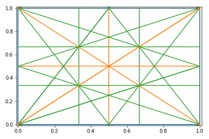
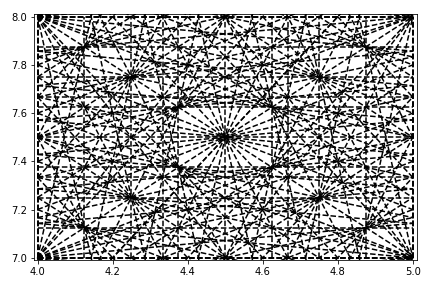
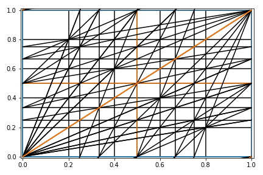

Tune Resonance Diagram for python

Implementation of a plotting routine for accelerator resonances.

    mx + ny = p
    x = (p-ny)/m
    x = 1 where y = (p-m)/n

## Example
See tunediagram.py for more info/details
```python
>>> from tunediagram import *
>>> 
>>> tunediagram(order=[1,2,3],color='ordered')
```

```python
>>> tunediagram(order=[1,3,8],integer=[4,7],colors='black',linestyle='--')
```

```python
>>> tunediagram(order=[1,2,3,4,5],colors='black3',lines=[1,1,1,0])
```

